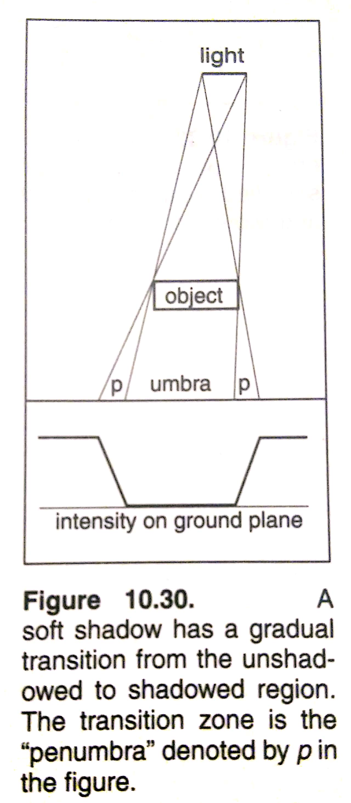
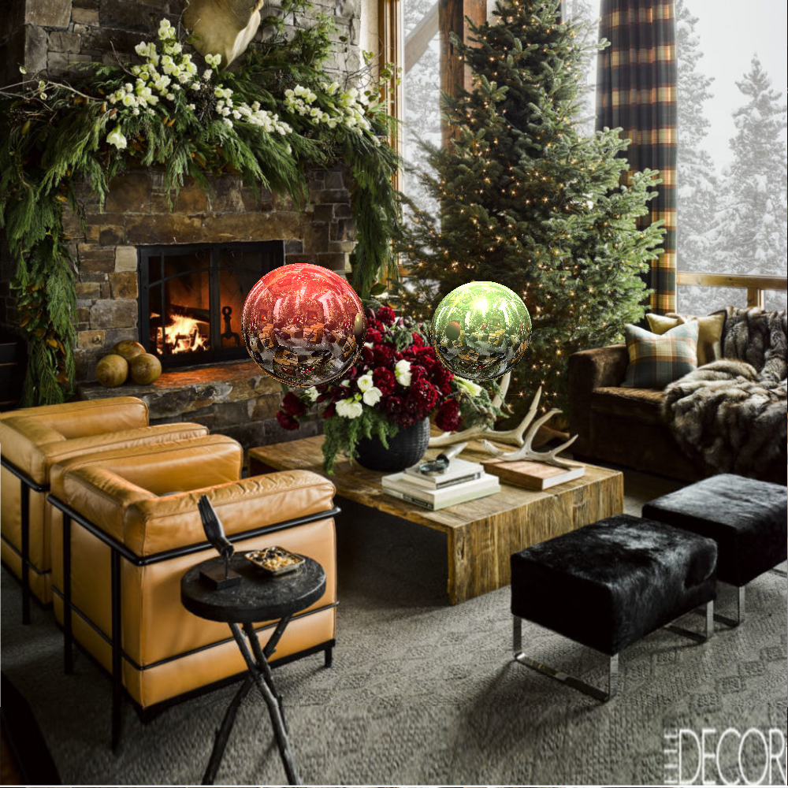
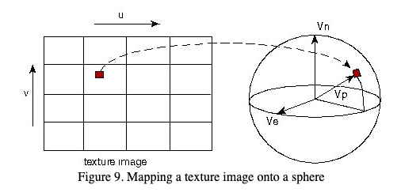

# RayTracer

## Table of Contents:
1. [Background](#background)
2. [Repository Files](#repository-files) (Outputs: 
   [Stage 1](#initial-image-with-basic-structures-and-area-lighting-for-shadow),
   [Stage 2](#second-stage-with-phongs-illumination-model),
   [Stage 3](#third-stage-with-anti-aliasing),
   [Final Stage](#final-stage-with-environment-mapping-and-texture-mapping))
3. [Code Structure](#code-structure)
4. [Additional Features](#additional-features)
5. [References](#references)

## Background:
This ray tracer basically "paints an image" based on a hypothetical scene set up in the viewpoint of e (as depicted below).  

<center>  </center>  
  
This image is created by shooting a ray through the image screen to the scene to colour each pixel on the screen using following basic algorithm structure:  

```
for each pixel:
  compute viewing ray
  find first object hit by ray and its surface normal N
  set pixel color to value based on material, light, and N
```  

Why the calculation of the normal from first hit is necessary is described below in the following paragraph. But the intersection calculations differ based on objects. For example, a sphere intersection is calculated as follows.  

<center>  </center>  

Note, the t in above image is denoted as variable ```lambda``` in code.

These hypothetical objects (T<sub>1</sub>, T<sub>2</sub>, T<sub>3</sub>) in the diagram each have an original colour (described as ambient). But how the colour is perceived to the eye e (and painted onto the image screen) depends on a variety of factors, which all rely on the basic understanding of light reflections. The ray directed from e to the object hits the object surface in the direction of the light source (called shadow ray or diffusion), denoted as vector L. However, the ray also bounces off to hit another object in the scene which reflects back on the original object, denoted vector R.  

Phong's Illumination Model sums up the combination of these characteristics using a simple formula, which is used in calculating shade colour for each pixel in this Ray Tracer:

<center>  </center>  
<center>  </center>  

Other concepts build on top of this idea are discussed in sections below.

## Repository Files
Note that the subsequent stages to building the final RayTracer (RayTracerScene2.c) are in files RayTracer.c and RayTracer2.c, with results depicted below.  

### Initial image (with basic structures and area lighting for shadow):
<center>  </center>  

### Second stage (with Phong's Illumination Model):
<center>  </center> 

### Third stage (with Anti-aliasing):
<center>  </center>   

### Final stage (with environment mapping and texture mapping):
<center>  </center>  
The header files (recieved as starter code and referenced in code) defined the basic algebraic structures such as a 3-D Point, Vector, Ray, Image plane (matrix), with functions to allow linear algebra calculations.  

## Code Structure
The code is structured in the following manner (except in reverse order in code):
```
main() {
  // Builds scene with objects in the viewpoint of the eye (point e in above diagram)
  buildScene()
  // OR Environment maps for final scene
  ⋮
  for each pixel:
    rayTrace() // ray trace followed by anti-aliasing here
  ⋮
  // write to output file
}
```

```
rayTrace() {
  while specified recursion depth is not reached:
    findFirstHit()
    rtShade()
}
```

```
findFirstHit() {
  // checks intersection of ray with object
  // checks if reflection of that ray will hit any other objects
  ⋮
  // passes lambda and next object intersection information down to rayTrace
}
```

```
rtShade() {
  // Uses Phong Illumination Model to return pixel colour to rayTrace
  // OR Uses Texture mapping to return pixel colour
}
```
## Additional Features

### Area-lighting
Area lighting allows for soft-shadows on the ground plane using the idea of partial visibility of light under penumbra region as depicted in diagram below.
<center>  </center>  
When an area light is present, rayTrace uses the object of next hit and lambda to calculate colour for each light source.  

### Anti-aliasing
Averages the colour calculation of a pixel with it's surrounding pixels for smoother representation, as done in the main function itself.

### Environment mapping
Places an image in the background of the objects such that colour calculations and reflections take its colours into account. An example of this image best shows that the same image is used as all sides of a boxed representation of scene through the reflection on the sphere.
<center>  </center>   

### Texture mapping
Lastly, the final stage image has spheres with texture maps which are calculated using Bi-linear interpolation using the basic ideas shown in diagram below.
<center>  </center>  

### Parallelizing
The following parallelizes the for loops (in C) that go over each pixel to reduce calculation time:
```
#pragma omp parallel for
```

## References
1. Fundamentals of Computer Graphics (2nd Edition), by Shirley et al.  
2. Lecture on Illumination and Shading: http://www.inf.ed.ac.uk/teaching/courses/cg/lectures/cg4_2016.pdf. 
3. Assignment instructions at Princeton: http://www.ctralie.com/PrincetonUGRAD/Projects/COS426/Assignment3/part1.html. 
4. Another ray tracing article: https://www.cs.unc.edu/~rademach/xroads-RT/RTarticle.html
