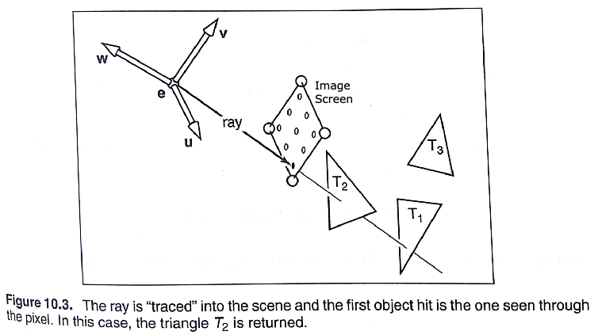
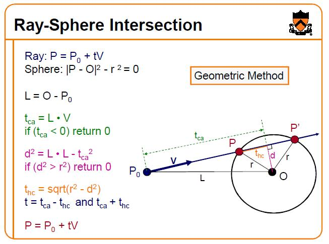
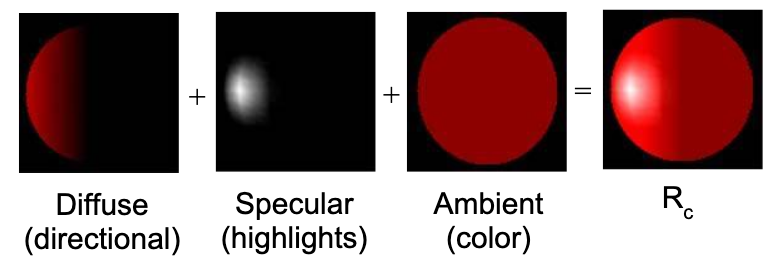
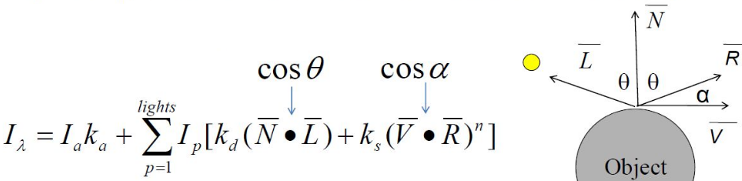
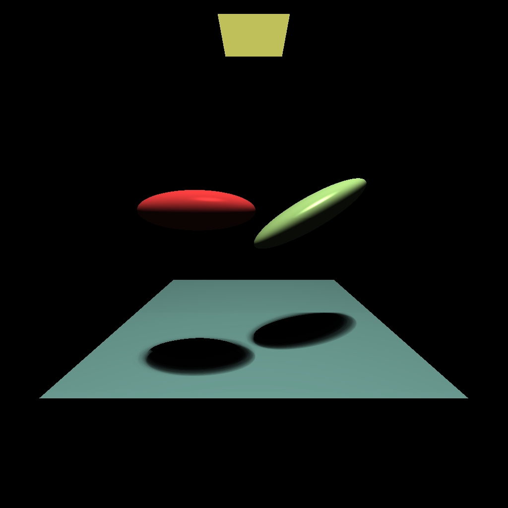
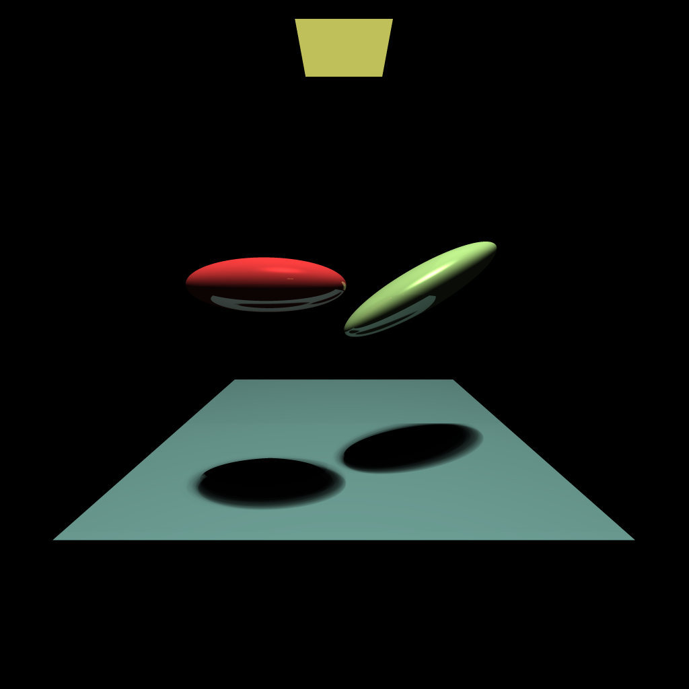
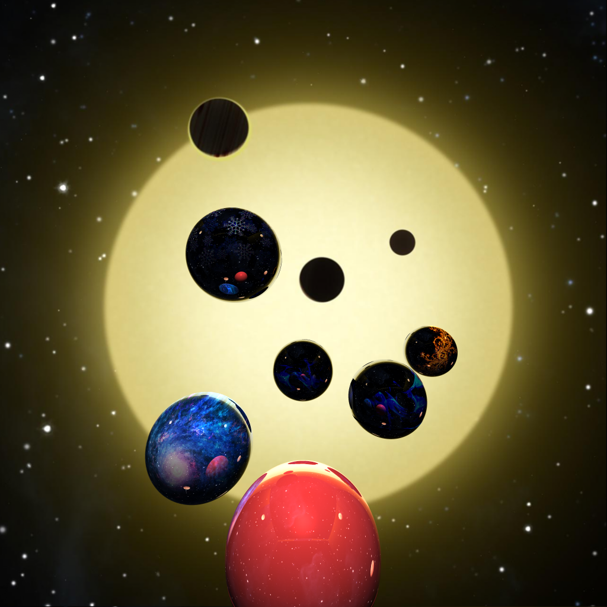

# RayTracer

## Background:
This ray tracer basically "paints an image" based on a hypothetical scene set up in the viewpoint of e (as depicted below).  

<center>  </center>  
  
This image is created by shooting a ray through the image screen to the scene to colour each pixel on the screen using following basic algorithm structure:  

```
for each pixel:
  compute viewing ray
  find first object hit by ray and its surface normal N
  set pixel color to value based on material, light, and N
```  

Why the calculation of the normal from first hit is necessary is described below in the following paragraph. But the intersection calculations differ based on objects. For example, a sphere intersection is calculated as follows.  

<center>  </center>  

Note, the t in above image is denoted as variable ```lambda``` in code.

These hypothetical objects (T<sub>1</sub>, T<sub>2</sub>, T<sub>3</sub>) in the diagram each have an original colour (described as ambient). But how the colour is perceived to the eye e (and painted onto the image screen) depends on a variety of factors, which all rely on the basic understanding of light reflections. The ray directed from e to the object hits the object surface in the direction of the light source (called shadow ray or diffusion), denoted as vector L. However, the ray also bounces off to hit another object in the scene which reflects back on the original object, denoted vector R.  

Phong's Illumination Model sums up the combination of these characteristics using a simple formula, which is used in calculating shade colour for each pixel in this Ray Tracer:

<center>  </center>  
<center>  </center>  

Other concepts build on top of this idea are discussed in sections below.

## Repository Files
Note that the subsequent stages to building the final RayTracer (RayTracerScene2.c) are in files RayTracer.c and RayTracer2.c, with results depicted below.  

### Initial image (with basic structures and area lighting for shadow):
<center>  </center>  

### Second stage (with Phong's Illumination Model implemented in function rtShade):
<center>  </center> 

### Third stage (with Anti-aliasing):
<center>  </center>   

### Final stage (with environment mapping and texture mapping):
<center>  </center>  
The header files (recieved as starter code and referenced in code) defined the basic algebraic structures such as a 3-D Point, Vector, Ray, Image plane (matrix), with functions to allow linear algebra calculations.  

## References:
[1] Fundamentals of Computer Graphics (2nd Edition), by Shirley et al.  
[2] Lecture on Illumination and Shading: http://www.inf.ed.ac.uk/teaching/courses/cg/lectures/cg4_2016.pdf. 
[3] Assignment instructions at Princeton: http://www.ctralie.com/PrincetonUGRAD/Projects/COS426/Assignment3/part1.html. 
